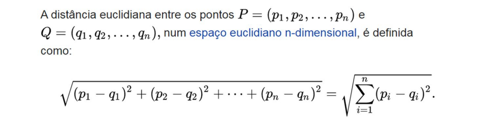

##### FA084 - Introdução à Mineração de Dados na Agricultura | Faculdade de Engenharia Agrícola da Unicamp


# Algorítmos de Recomendação de Tarefas | Similaridade Euclidiana | #task1

Algoritmo de recomendação que sugere tarefas para funcionários de acordo com as avaliações de outros funcionários com preferências similares.

## 📌 Objetivo
Recomendar tarefas **não realizadas** por um funcionário específico, utilizando avaliações de outros funcionários com padrões de avaliação semelhantes.

## Funcionamento

### Distância Euclidiana


Figura 1: Distância Euclidiana. Fonte: Mineração de dados Aula 3 – lista de recomendações . Prof Dr. Eduardo Nunes

### Bibliotecas utilizadas
Importe a função sqrt da biblioteca math do python
```python
from math import sqrt
```

### Dicionário base com as notas dos funcionários
Crie um dicionário contendo os funcionários e os valores de suas avaliações

```python
avaliacoes = {
    "Maria": {"desbrota": 9, "pulverização": 6, "adubação": 8, "embalagem": 8, "seleção": 8},
    "Antônio": {"colheita": 6, "capina": 8},
    "João": {"desbrota": 3, "capina": 7, "embalagem": 4, "seleção": 2},
    "Pedro": {"colheita": 7, "pulverização": 9, "capina": 7},
    "Lara": {"desbrota": 4, "capina": 6, "seleção": 7},
    "Miguel": {"desbrota": 6, "adubação": 6},
    "Julia": {"pulverização": 7, "capina": 5, "seleção": 8},
    "Clara": {"colheita": 8, "embalagem": 6},
    "Ana": {"desbrota": 4, "pulverização": 5, "adubação": 7}
}
```

### Recomendação de tarefas
O script calcula a similaridade entre as notas dadas aos  funcionários para diferentes tarefas e, usando a **Distância Euclidiana**, pondera as avaliações de tarefas de funcionários similares.

#### Função similaridade_euclidiana(base, funcionario1, funcionario2)
- O trecho de código a seguir cria uma função chamada 'similaridade_euclidiana' que recebe 3 argumentos: base, funcionario1 e funcionario2. 
- Em seguida, cria um dicionário 'tarefas_comuns'. A função entra então no primeiro loop, procurando por tarefas comuns entre o funcionario1 e funcionario2 (lembrando que dicionários são estruturas do tipo chave-valor). Essa tarefa em comum é adiconada a uma lista com valor 1. 
- Após sair do loop, o código avalia o tamanho da lista 'tarefas_comuns' e, caso esteja vazia, retorna 0. Caso a lista não esteja vazia, é realizada uma soma (correspondente à soma de dentro da raíz na equação da figura 1).
- Após realizar essa soma, o algoritimo entra em um novo loop, percorrendo as tarefas da lista tarefas_comuns, retornando a soma euclidiana para cada valor da lista. 

```python
def similaridade_euclidiana(base, funcionario1, funcionario2):
    tarefas_comuns = {}
    for tarefa in base[funcionario1]:
        if tarefa in base[funcionario2]:
            tarefas_comuns[tarefa] = 1
    
    if len(tarefas_comuns) == 0:
        return 0
    
    soma = sum([pow(base[funcionario1][tarefa] - base[funcionario2][tarefa], 2) 
              for tarefa in tarefas_comuns])
    return 1 / (1 + sqrt(soma))

```

### Recomendação de pessoa para a tarefa de pulverização
```python
def recomendar_pulverizacao(base, tarefa_alvo):
    scores = {}
    for pessoa in base:
        if tarefa_alvo in base[pessoa]:
            scores[pessoa] = base[pessoa][tarefa_alvo]
        else:
            total = 0
            sum_sim = 0
            for outra_pessoa in base:
                if outra_pessoa == pessoa:
                    continue
                if tarefa_alvo not in base[outra_pessoa]:
                    continue
                sim = similaridade_euclidiana(base, pessoa, outra_pessoa)
                if sim > 0:
                    total += sim * base[outra_pessoa][tarefa_alvo]
                    sum_sim += sim
            if sum_sim > 0:
                predicted_score = total / sum_sim
                scores[pessoa] = predicted_score
    rankings = sorted(scores.items(), key=lambda x: x[1], reverse=True)
    return rankings
```
### Fórmula de Recomendação
O trecho de código a seguir cria uma função que recebe 2 argumentos: base e funcionário alvo. A primeira etapa consiste em criar dois dicionários (totais e soma_similaridade). 

```python
def recomendar_tarefas(base, funcionario_alvo):
    totais = {}
    soma_similaridade = {}
    
    for outro_funcionario in base:
        if outro_funcionario == funcionario_alvo:
            continue
        
        sim = similaridade_euclidiana(base, funcionario_alvo, outro_funcionario)
        if sim <= 0:
            continue
        
        for tarefa in base[outro_funcionario]:
            if tarefa not in base[funcionario_alvo]:
                totais.setdefault(tarefa, 0)
                totais[tarefa] += base[outro_funcionario][tarefa] * sim
                soma_similaridade.setdefault(tarefa, 0)
                soma_similaridade[tarefa] += sim
    
    if not totais:
        return []
    
    rankings = [(total / soma_similaridade[tarefa], tarefa) 
                for tarefa, total in totais.items()]
    rankings.sort(reverse=True)
    return rankings
```

### Recomendação de pessoa para pulverização
Para chamar as funções, criamos uma nova variável que é inicializada com o valor retornado da função 'recomendar_pulverizacao', passando como argumento o dicionário base ('avaliacoes') e a string com o nome da tarefa. 

O tipo de estrutura de dados das variaveis 'pessoa' e 'score' é o dicionário (chave-valor).

```python
# Recomendação de pessoa para pulverização
print("\nPessoas recomendadas para pulverização:")
recomendacoes_pulverizacao = recomendar_pulverizacao(avaliacoes, "pulverização")
for pessoa, score in recomendacoes_pulverizacao:
    print(f"- {pessoa}: Score {score:.2f}")
```
O resultado esperado é: 

| Pessoa   | Score |
|----------|-------|
| Pedro    | 9.00  |
| Antônio  | 8.25  |
| Clara    | 7.80  |
| João     | 7.52  |
| Julia    | 7.00  |
| Lara     | 6.44  |
| Maria    | 6.00  |
| Miguel   | 5.41  |
| Ana      | 5.00  |


### Recomendação de tarefa para Júlia
```python
# Recomendação de tarefas para Júlia
recomendacoes_pessoa = recomendar_tarefas(avaliacoes, "Julia")
print("Tarefas recomendadas para Julia:")
for score, tarefa in recomendacoes_pessoa:
    print(f"- {tarefa}: Score {score:.2f}")
```
O resultado esperado é: 

| Tarefa    | Score |
|:---------:|:-----:|
| adubação  | 7.60  |
| embalagem | 7.14  |
| colheita  | 6.51  |
| desbrota  | 5.71  |

### Avaliação de desempenho
O algoritmo funciona bem com a quantidade de dados do nosso dicionário. Porém, em contextos de aplicações reais, é importante pensarmos: este algorítmo é o mais eficiênte, dado meus objetivos/recursos? 

Note que o script implementado, além de poucos dados do dicionário, executa 3 funções diferentes, com laços de repetições, operações matemáticas e uso de funções de ordenação. Cada uma dessas operações consome uma quantidade de recurso computacional e, consequentemente, afeta a velocidade com que nosso algoritmo executa as tarefas. 

Nestes casos, podemos realizar uma avaliação de performance para nosso código, onde calculamos os 'gastos' em cada um dos passos.

>  "Para um dado problema considere dois algoritmos que o resolvem. Seja n um parâmetro que caracteriza o tamanho da entrada do algoritmo. Por exemplo, ordenar n números ou multiplcar duas matrizes quadradas n × n (cada uma com n^2 elementos). Como podemos comparar os dois algoritmos para escolher o melhor? Precisamos definir alguma medida que expresse a eficiência. Costuma-se medir um algoritmo em termos de tempo de execução ou o espaço (ou memória) usado."

Fonte: Complexidade de Algoritmos. Autor: Siang Wun Song - Universidade de São Paulo - IME/USP MAC 5710 - Estruturas de Dados - 2008. 
[acessar documento](https://www.ime.usp.br/~song/mac5710/slides/01complex.pdf)

**Análise de complexidade de tempo e espaço**

- Função similaridade_euclidiana(base, funcionario1, funcionario2) = **O(T1 + Tc) ≈ O(T)**

- Função recomendar_tarefas(base, funcionario_alvo) = **O(N * (T + K) + M log M)**

- Função recomendar_pulverizacao(base, tarefa_alvo) = **O(N^2 * T + N log N)**


----- 
Dada a análise de complexidade de tempo e espaço, podemos analisar que o algoritmo é adequado para este contexto específico, onde a quantidade de funcionários é baixa, pois a funcção recomendar_pulverizacoes possui um N², tornando custoso para valores altos.  